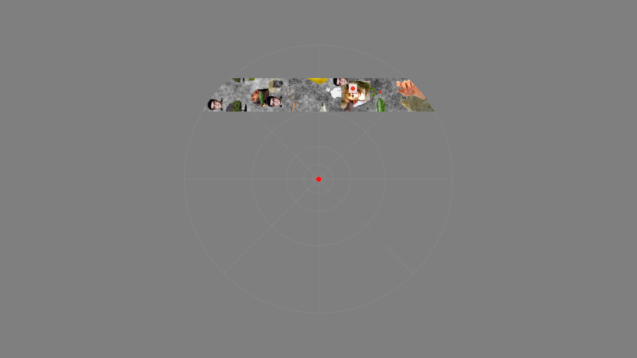

# Retinotopy Experiment (Go Implementation)



Welcome! This repository contains a Go implementation of the **HCP Retinotopic Mapping experiment** described in: 

> Benson, N. C., Jamison, K. W., Arcaro, M. J., Vu, A. T., Glasser, M. F., Coalson, T. S., Van Essen, D. C., Yacoub, E., Ugurbil, K., Winawer, J., & Kay, K. (2018). The Human Connectome Project 7 Tesla retinotopy dataset: Description and population receptive field analysis. *Journal of Vision*, 18(13), 23. https://doi.org/10.1167/18.13.23


This app relies on [goxpyriment](https://github.com/chrplr/goxpyriment).

**Warning: The timing of presentation has not been checked yet.**

*If you find issues, please report them on <https://github.com/chrplr/retinotopy-go>*


Christophe Pallier 05/03/2026 [](https://doi.org/10.5281/zenodo.18887912)

---

## 1. Installation (Fastest Start)

Go to the [Releases](https://github.com/chrplr/retinotopy-go/releases) page and download the version for your computer.

### Windows
1.  Download the `retinotopy_windows_amd64.zip` (Standard PCs) or `retinotopy_windows_arm64.zip` (Surface Pro X, etc.).
2.  Extract the ZIP file.
3.  **Run:** Double-click `retinotopy.exe`. 
    *Note: The required `SDL3.dll` is already included in the ZIP.*

### Linux (Ubuntu/Debian/Fedora)
1.  Download the `.deb` (Ubuntu/Debian) or `.rpm` (Fedora/RedHat) package.
2.  **Install:**
    - **Ubuntu/Debian:** `sudo apt install ./retinotopy_linux_amd64.deb`
    - **Fedora:** `sudo dnf install ./retinotopy_linux_amd64.rpm`
3.  **Run:** Open your terminal and type `retinotopy -s 0 -r 1`.
    *Note: The installer automatically handles the `SDL3` dependency and places assets in the correct system folder.*

### macOS
1.  Download `retinotopy_darwin_arm64.zip` (Apple Silicon M1/M2/M3) or `retinotopy_darwin_amd64.zip` (Intel Macs).
2.  Extract the ZIP file.
3.  **Security Fix:** Open Terminal in the extracted folder and run:
    ```bash
    xattr -d com.apple.quarantine retinotopy
    chmod +x retinotopy
    ```
4.  **Run:** `./retinotopy -s 0 -r 1`

---

## 2. Building from Source (For Developers)

If you want to modify the code or compile it yourself, follow these steps.

### Prerequisites
1.  **Install Go:** [go.dev/doc/install](https://go.dev/doc/install)
2.  **Install SDL3:** (See Step A above). 
    *Note: Because this project uses `purego`, you do **not** need C compilers or SDL3 development headers (`-dev` packages) to compile.*

### Getting Started
1.  **Clone the Repository:**
    ```bash
    git clone https://github.com/yourusername/retinotopy-go.git
    cd retinotopy-go
    ```
2.  **Download Dependencies:**
    ```bash
    go mod download
    ```

### Running/Building
- **To Run directly:** `go run retinotopy.go -s 0 -r 1`
- **To Build your own executable:** `go build -o my_retinotopy`

---

## 3. Command Line Options

Customize the experiment using these flags:

| Flag | Description | Default |
| :--- | :--- | :--- |
| `-s <id>` | **Subject ID** (used for data logging and stimuli order) | `0` |
| `-r <id>` | **Run ID** (1 to 6, see below) | `1` |
| `-d` | **Development Mode**: Runs in a 900x900 window instead of fullscreen. | `false` |
| `--scaling <f>` | **Scaling Factor**: Adjusts the size of stimuli (e.g., `1.5` for 150% size). | `1.0` |
| `-assets <path>`| **Assets Directory**: Path to the `assets/` folder. | `./assets` |

### Available Runs (`-r`)
1. `RETBAR1` / 2. `RETBAR2` (Swiping Bars)
3. `RETCCW` (Counter-Clockwise Wedge) / 4. `RETCW` (Clockwise Wedge)
5. `RETEXP` (Expanding Circles) / 6. `RETCON` (Contracting Circles)

---

## 4. Controls & Data

-   **ESC:** Exit and save data.
-   **Any Key/Mouse Click:** Press when the center fixation dot changes color.
-   **Data:** Results are saved as `.xpd` files in the `data/` directory with frame-by-frame timing and event logs.

---

## Troubleshooting

- **"SDL3 not found":** Re-check Step A. The library must be installed or the DLL must be in the folder.
- **"Assets not found":** Run the command from the root of the project directory.

---

## See also:

* <https://osf.io/bw9ec/overview> (original version)
* <https://github.com/Goffaux-Lab/psychopy-retinotopy>
* <https://github.com/hiroshiban/Retinotopy>
* <https://github.com/egaffincahn/RetinotopicMapping>

---

# License and Authorship

Developed by [Christophe Pallier](https://github.com/chrplr) (2026). (Porting a previous Python using [Expyriment](http://expyriment.org) with the help of Gemini)
 
Distributed under the GNU General Public License v3.
