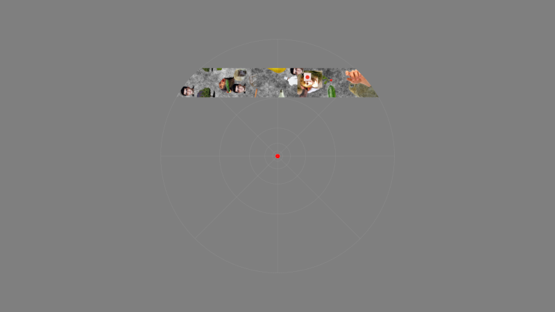

# Retinotopy Experiment (Go Implementation)



This app runs the **HCP Retinotopic Mapping experiment** — a visual stimulus protocol used in brain imaging (fMRI) studies to map how the visual cortex is organized. Subjects watch a series of flickering checkerboard patterns (bars, rotating wedges, expanding/contracting rings) while occasionally pressing a key when a central dot changes color. The recorded timing data is used to reconstruct a map of the visual field on the brain.

It is also a working example of how to use the [goxpyriment](https://github.com/chrplr/goxpyriment) library to build standalone experiment executables in Go.

The experiment is based on:

> Benson, N. C., Jamison, K. W., Arcaro, M. J., Vu, A. T., Glasser, M. F., Coalson, T. S., Van Essen, D. C., Yacoub, E., Ugurbil, K., Winawer, J., & Kay, K. (2018). The Human Connectome Project 7 Tesla retinotopy dataset: Description and population receptive field analysis. *Journal of Vision*, 18(13), 23. https://doi.org/10.1167/18.13.23

> **Warning: Stimulus timing has not been independently validated yet. Use with caution in actual experiments.**

*Found a bug? Please report it at <https://github.com/chrplr/retinotopy-go/issues>*

Christophe Pallier, 05/03/2026 [](https://doi.org/10.5281/zenodo.18887912)

---

## 1. Installation from binaries


Download the latest installer for your operating system directly below. All required files are bundled — no extra software needed.

### Windows
1. Download [retinotopy-windows-x86_64-setup.exe](https://github.com/chrplr/retinotopy-go/releases/latest/download/retinotopy-windows-x86_64-setup.exe) (Intel/AMD) or [retinotopy-windows-arm64-setup.exe](https://github.com/chrplr/retinotopy-go/releases/latest/download/retinotopy-windows-arm64-setup.exe) (ARM).
2. Double-click the file and follow the installer steps.
3. A **Retinotopy** shortcut will appear in your Start Menu and on your Desktop.

### macOS
1. Download [retinotopy-macos-arm64-app.zip](https://github.com/chrplr/retinotopy-go/releases/latest/download/retinotopy-macos-arm64-app.zip) (M1/M2/M3/M4) or [retinotopy-macos-x86_64-app.zip](https://github.com/chrplr/retinotopy-go/releases/latest/download/retinotopy-macos-x86_64-app.zip) (Intel).
2. Extract the archive and drag **Retinotopy.app** to your **Applications** folder (or anywhere you like).
3. Double-click to launch.

> [!WARNING]
> macOS may show a security warning the first time you open the app. See [macOS installation and security](https://chrplr.github.io/note-about-macos-unsigned-apps) for an explanation and step-by-step instructions to bypass it.

### Linux
1. Download [retinotopy-linux-x86_64.AppImage](https://github.com/chrplr/retinotopy-go/releases/latest/download/retinotopy-linux-x86_64.AppImage) (Intel/AMD) or [retinotopy-linux-aarch64.AppImage](https://github.com/chrplr/retinotopy-go/releases/latest/download/retinotopy-linux-aarch64.AppImage) (ARM).
2. Make it executable: right-click the file → **Properties** → **Permissions** → check **"Allow executing file as program"**.
3. Double-click to run.

---

## 2. Alternative: ZIP archives and system packages

If you prefer not to use an installer, download a raw binary archive from the [Releases page](https://github.com/chrplr/retinotopy-go/releases).

- **Windows ZIP:** Extract and run `retinotopy.exe` (SDL3.dll is included in the archive).
- **Linux packages:** `.deb` (Ubuntu/Debian) and `.rpm` (Fedora/RHEL) are available on the Releases page.

---

## 3. Running the Experiment

### Controls

| Action | Effect |
| :--- | :--- |
| **Any key or mouse click** | Register response when the fixation dot changes color |
| **ESC** | Exit and save data |

### Choosing a run

Launch the app with a subject ID (`-s`) and run number (`-r`):

```
retinotopy -s 1 -r 3
```

The six available runs are:

| `-r` | Name | Stimulus |
| :--- | :--- | :--- |
| 1 | RETBAR1 | Swiping bars (first pass) |
| 2 | RETBAR2 | Swiping bars (second pass) |
| 3 | RETCCW | Counter-clockwise rotating wedge |
| 4 | RETCW | Clockwise rotating wedge |
| 5 | RETEXP | Expanding circles |
| 6 | RETCON | Contracting circles |

### All command-line options

| Flag | Description | Default |
| :--- | :--- | :--- |
| `-s <id>` | Subject ID (used for data logging and stimulus order) | `0` |
| `-r <id>` | Run number (1–6, see above) | `1` |
| `-d` | Development mode: runs in a 900×900 window instead of fullscreen | off |
| `--scaling <f>` | Scale stimulus size (e.g. `1.5` = 150%) | `1.0` |
| `-assets <path>` | Path to the `assets/` folder | `./assets` |

---

## 4. Building from Source

Only needed if you want to modify the code or compile it yourself.

### Prerequisites

1. **Install Go:** [go.dev/doc/install](https://go.dev/doc/install)

### Build steps

```bash
git clone https://github.com/chrplr/retinotopy-go.git
cd retinotopy-go
go mod download
go run retinotopy.go -s 0 -r 1     # run directly
go build -o retinotopy              # build an executable
```

To cross-compile for all platforms at once:

```bash
./build.sh
```

---

## See also

- <https://osf.io/bw9ec/overview> (original Matlab version)
- <https://github.com/Goffaux-Lab/psychopy-retinotopy>
- <https://github.com/hiroshiban/Retinotopy>
- <https://github.com/egaffincahn/RetinotopicMapping>

---

## License and Authorship

Developed by [Christophe Pallier](https://github.com/chrplr) (2026), porting a previous Python/[Expyriment](http://expyriment.org) version with the help of Gemini.

Distributed under the [GNU General Public License v3](https://www.gnu.org/licenses/gpl-3.0.html).
